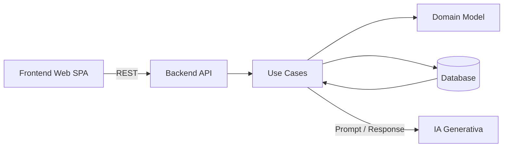

# 1. Principios de la arquitectura (no negociables)

Antes del dibujo, las reglas:

1. **Un solo flujo E2E gobierna la arquitectura**
   Todo componente existe para soportar:
   *login → tope → gasto → alerta*

2. **Separación clara de responsabilidades**

   * Front: interacción y estado de UI
   * Back: reglas de negocio y persistencia
   * IA: transformación y generación, no control de flujo

3. **IA como dependencia externa, no como core del sistema**
   Si mañana quitas la IA, el sistema sigue siendo coherente (aunque menos útil).

---

# 2. Arquitectura mínima – Vista lógica

## Componentes principales

### Frontend (Web App)

Responsable de:

* Interacción con el usuario
* Captura de lenguaje natural
* Visualización de estado

### Backend (API)

Responsable de:

* Autenticación
* Reglas de negocio
* Persistencia
* Orquestación con IA

### Servicio de IA Generativa

Responsable de:

* Extracción estructurada
* Generación de texto (alertas)

### Base de Datos

Responsable de:

* Estado persistente del dominio

---

# 3. Arquitectura Frontend (mínima pero correcta)

## Frontend Web (SPA)

**Responsabilidades**

* Registro / login
* Input libre de texto para gastos
* Visualización:

  * Tope mensual
  * Gasto acumulado
  * Lista de gastos
  * Alerta (si existe)

**Componentes mínimos**

* `AuthView`
* `DashboardView`
* `ExpenseInput`
* `ExpenseList`
* `AlertBanner`

**Reglas claras**

* ❌ El frontend NO llama directamente a la IA
* ❌ El frontend NO calcula totales
* ✅ El frontend solo consume la API

**Estado**

* Estado de sesión
* Estado de vista actual
* Datos devueltos por backend

---

# 4. Arquitectura Backend (donde vive la lógica real)

## Backend API (Monolito lógico)

No microservicios. No “clean architecture” ceremoniosa.
Un **monolito bien hecho** es lo correcto para un MVP.

### Capas mínimas

#### 1️⃣ API / Controllers

* Expone endpoints REST
* Valida inputs básicos
* No contiene lógica de negocio

Ejemplos:

* `POST /auth/register`
* `POST /auth/login`
* `POST /monthly-limit`
* `POST /expenses`
* `GET /dashboard`

---

#### 2️⃣ Application / Use Cases

Aquí vive el **flujo E2E**.

Ejemplos:

* `RegisterExpenseUseCase`
* `SetMonthlyLimitUseCase`

Responsabilidades:

* Orquestar:

  * Persistencia
  * Cálculos
  * Llamadas a IA
* Tomar decisiones de negocio

---

#### 3️⃣ Domain

Modelo puro:

* `User`
* `Expense`
* `MonthlyLimit`

Sin frameworks. Sin IA. Sin HTTP.

---

#### 4️⃣ Infrastructure

Implementaciones concretas:

* Repositorios DB
* Cliente de IA generativa
* Hash de contraseñas

---

# 5. Dónde entra la IA

## Servicio de IA Generativa (adapter)

### Casos de uso reales

#### A. Extracción de gasto

Input:

```text
"Gasté 45.000 en mercado hoy"
```

Output estructurado:

```json
{
  "amount": 45000,
  "category": "Alimentación",
  "expense_date": "2025-06-10",
  "description": "Compra de mercado"
}
```

#### B. Generación de alerta

Input:

* Tope
* Total acumulado
* Último gasto

Output:
Texto comprensible para humanos.

---

### Regla de oro

La IA:

* ❌ No decide si se guarda un gasto
* ❌ No controla el flujo
* ✅ Solo **transforma información**

Esto es **arquitectura madura**.

---

# 6. Diagrama Mermaid – Arquitectura mínima



---

# 7. Flujo E2E sobre esta arquitectura

1. Usuario envía texto de gasto desde el frontend
2. API recibe la solicitud
3. Use Case:

   * Llama a IA para extracción
   * Valida resultado
   * Persiste gasto
   * Calcula total mensual
   * Decide si hay alerta
   * Llama a IA para texto de alerta (si aplica)
4. Backend devuelve estado consolidado
5. Frontend renderiza

---

# 8. Lo que deliberadamente NO hicimos

* No event bus
* No CQRS
* No microservicios
* No BFF separado
* No caché
* No observabilidad avanzada

Porque **no aporta valor al objetivo del proyecto**.