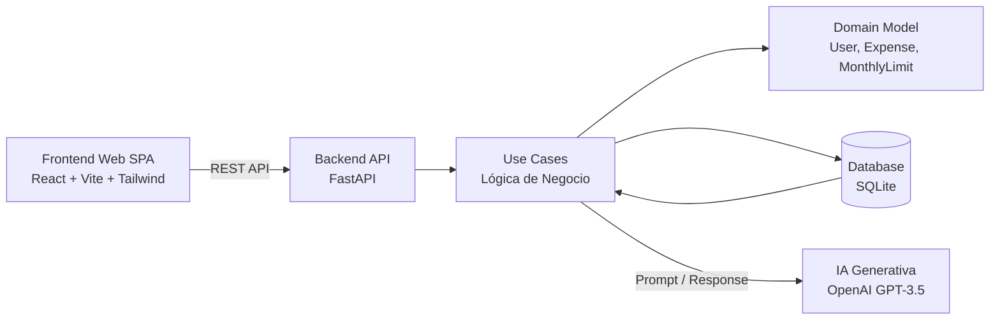
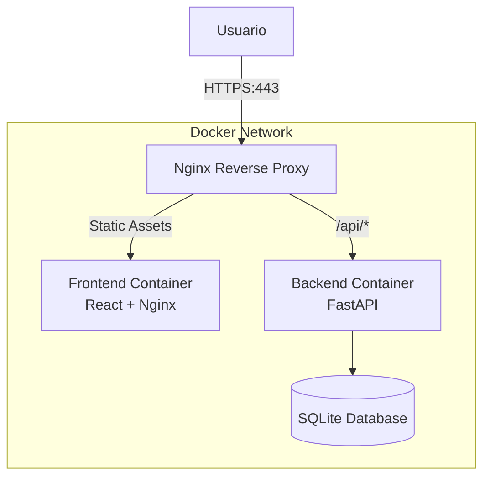
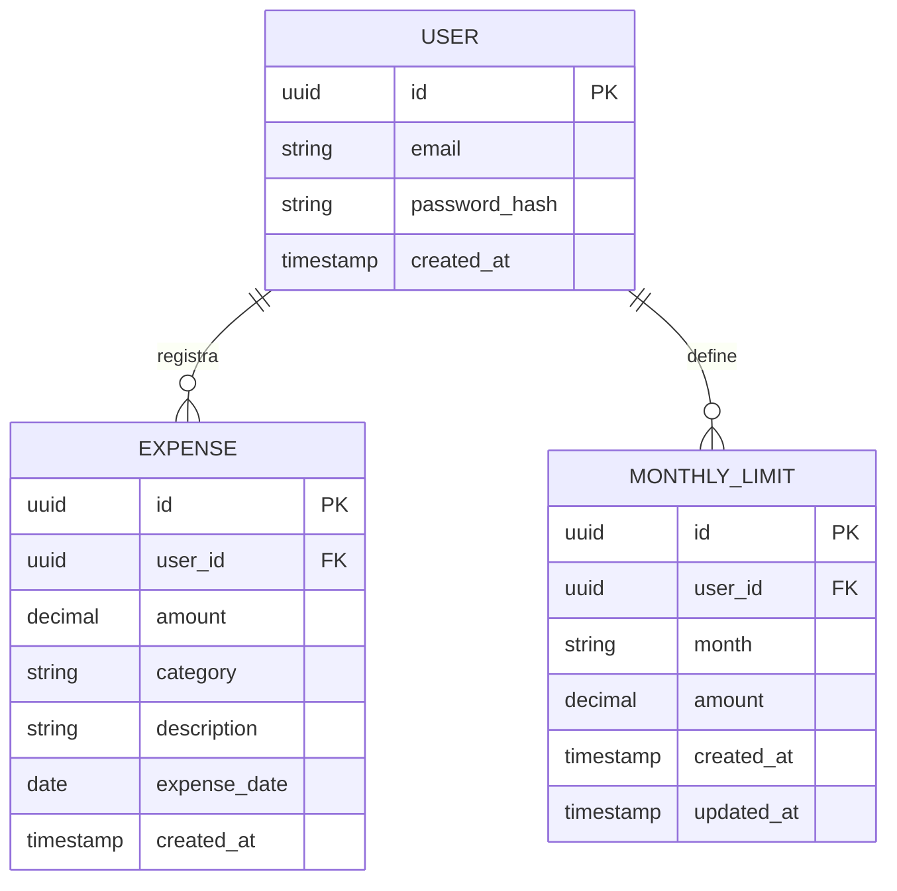
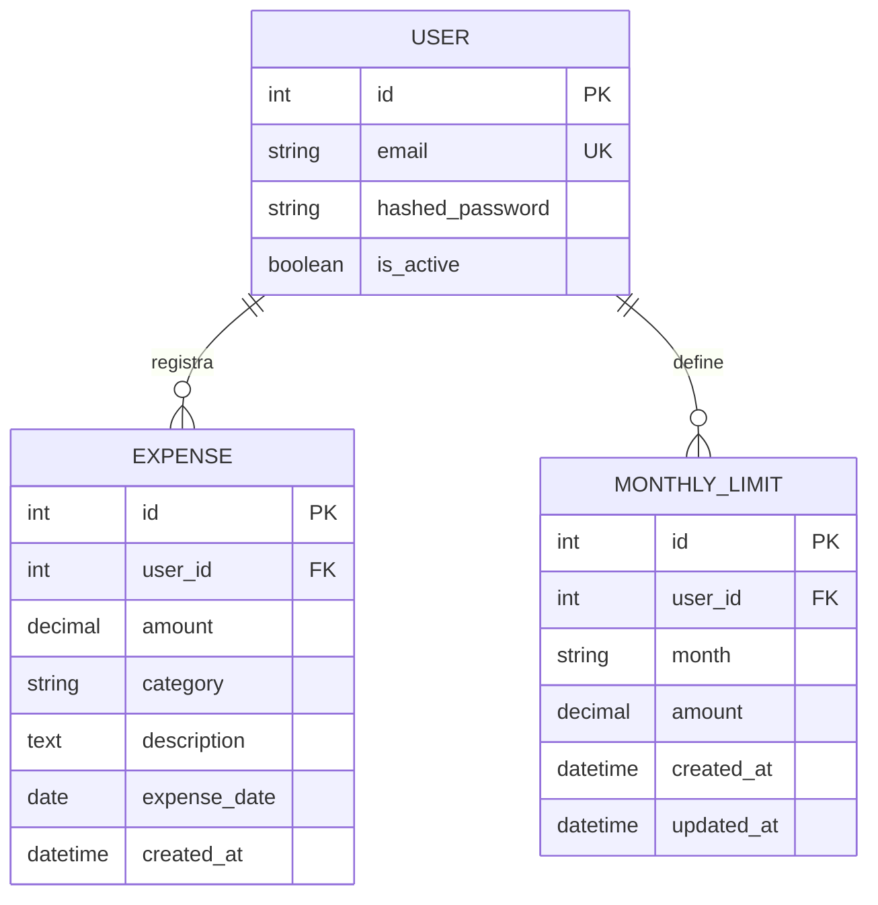

## Índice

0. [Ficha del proyecto](#0-ficha-del-proyecto)
1. [Descripción general del producto](#1-descripción-general-del-producto)
2. [Arquitectura del sistema](#2-arquitectura-del-sistema)
3. [Modelo de datos](#3-modelo-de-datos)
4. [Especificación de la API](#4-especificación-de-la-api)
5. [Historias de usuario](#5-historias-de-usuario)
6. [Tickets de trabajo](#6-tickets-de-trabajo)
7. [Pull requests](#7-pull-requests)

---

## 0. Ficha del proyecto

El objetivo del presente proyecto es por medio del uso de herramientas de Inteligencia Artificial Generativa implementar un proceso de ingeniería de software con el uso de las mismas.

### **0.1. Tu nombre completo:**

Nilson Giovanny Valdés Muñoz

### **0.2. Nombre del proyecto:**

Gestor de Gastos Personal (GGP)

### **0.3. Descripción breve del proyecto:**

Las personas no registran sus gastos porque el proceso suele resultar tedioso, rígido y requiere disciplina constante. El proyecto pretende desarrollar una aplicación web que permita reducir la fricción y mejorar la comprensión financiera con mínima interacción del usuario.
Para ello se pretende que el usuario no solo use la interfaz gráfica de la aplicación sino que pueda usar herramientas como un chatbot para agilizar el registro de los gastos.

### **0.4. URL del proyecto:**

https://github.com/nigivamu/AI4Devs-finalproject

### 0.5. URL o archivo comprimido del repositorio

https://github.com/nigivamu/AI4Devs-finalproject


---

## 1. Descripción general del producto

### **1.1. Objetivo:**

Demostrar cómo un desarrollador puede utilizar IA generativa como copiloto integral a lo largo del ciclo de vida del software. Desde la ideación hasta la validación, mediante la construcción de un MVP funcional de seguimiento de gastos personales con interacción en lenguaje natural.

Para ello se ha escogido desarrollar un Software para Gestión de Gastos Personales que permita:

* **Reducir el esfuerzo y la disciplina** requerida para registrar gastos de forma consistente.
* Brindar control **básico** y percepción temprana de exceso de gasto.
* Mantener simplicidad técnica y foco en el valor principal.
* Permitir decisiones rápidas sin interpretación técnica de datos.

### **1.2. Características y funcionalidades principales:**

El producto:
* Introduce un mecanismo explícito de auto–limitación (tope mensual) que permita al usuario tomar conciencia de sus hábitos de gasto sin análisis financiero avanzado. 
* Comunica eventos relevantes (exceso de tope) en lenguaje natural, evitando métricas abstractas o dashboards complejos. 
* Permite al usuario interactuar con el sistema usando lenguaje natural para registrar información financiera, eliminando formularios complejos y reduciendo fricción cognitiva.
* Gestiona datos únicamente del usuario autenticado, sin funcionalidades sociales ni multiusuario.

### **1.3. Diseño y experiencia de usuario:**

La interfaz de usuario se basa en un diseño minimalista y centrado en la reducción de fricción cognitiva. La aplicación web utiliza React con Tailwind CSS para una experiencia moderna y responsiva.

#### Componentes Principales de la Interfaz:

**Vista de Autenticación ([`AuthView.jsx`](frontend/src/components/AuthView.jsx:1))**
- Formulario unificado para registro e inicio de sesión
- Diseño con gradiente visual atractivo
- Validación de email y contraseña (mínimo 6 caracteres)
- Transición fluida entre modos de registro/login
- Mensajes de error claros y visibles

**Vista de Dashboard ([`DashboardView.jsx`](frontend/src/components/DashboardView.jsx:1))**
- Pantalla principal con información financiera consolidada
- Tarjetas de estadísticas: Gasto Total, Presupuesto, Disponible
- Gráfica de evolución de gastos por fecha
- Lista de movimientos recientes
- Banner de alerta para excedentes de presupuesto

**Componente de Registro de Gastos ([`ExpenseInput.jsx`](frontend/src/components/ExpenseInput.jsx:1))**
- Campo de texto libre para entrada en lenguaje natural
- Botón de envío con indicador de carga
- Frases de ejemplo para guiar al usuario
- Feedback inmediato de éxito o error
- Soporte para envío con tecla Enter

**Componente de Lista de Gastos ([`ExpenseList.jsx`](frontend/src/components/ExpenseList.jsx:1))**
- Visualización cronológica de gastos
- Iconos por categoría (Alimentación, Transporte, Entretenimiento, etc.)
- Formato de fecha localizado (es-CO)
- Estado vacío con mensaje amigable

**Componente de Progreso de Presupuesto ([`BudgetProgress.jsx`](frontend/src/components/BudgetProgress.jsx:1))**
- Gráfico circular de progreso mensual
- Indicador de porcentaje gastado
- Colores dinámicos según estado (verde, naranja, rojo)
- Visualización de monto gastado y disponible

**Componente de Tope Mensual ([`MonthlyLimit.jsx`](frontend/src/components/MonthlyLimit.jsx:1))**
- Visualización del límite actual
- Modo de edición inline
- Validación de valores positivos
- Actualización inmediata sin recarga

**Banner de Alerta ([`AlertBanner.jsx`](frontend/src/components/AlertBanner.jsx:1))**
- Notificación destacada cuando se excede el tope
- Mensaje generado por IA
- Opción de descartar alerta
- Diseño con icono de advertencia

#### Principios de Diseño:

1. **Minimalismo**: Interfaz limpia sin elementos distractores
2. **Feedback Inmediato**: Confirmación visual de cada acción
3. **Accesibilidad**: Colores con contraste adecuado y etiquetas claras
4. **Responsividad**: Diseño adaptable a diferentes tamaños de pantalla
5. **Lenguaje Natural**: Entrada de datos sin formularios complejos

### **1.4. Instrucciones de instalación:**

**Backend (Python/FastAPI):**
1. Navega a la carpeta `backend/`.
2. Sigue las instrucciones detalladas en [backend/README.md](backend/README.md).
3. Resumen rápido:
   ```bash
   cd backend
   python3 -m venv venv && source venv/bin/activate
   pip install -r requirements.txt
   uvicorn main:app --reload
   ```

---

## 2. Arquitectura del Sistema

### **2.1. Diagrama de arquitectura:**



**Descripción del flujo:**

1. El usuario interactúa con el Frontend Web SPA (React)
2. El Frontend realiza peticiones REST al Backend API (FastAPI)
3. El Backend procesa las solicitudes a través de los Use Cases (lógica de negocio)
4. Los Use Cases interactúan con el Domain Model (entidades del dominio)
5. Los Use Cases persisten datos en la Database (SQLite)
6. Los Use Cases consultan el servicio de IA Generativa (OpenAI) para:
   - Extracción de datos estructurados desde lenguaje natural
   - Generación de mensajes de alerta

### **2.2. Descripción de componentes principales:**

#### Frontend (Web SPA)
- **Tecnología**: React + Vite + Tailwind CSS
- **Responsabilidades**:
  - Interacción con el usuario
  - Captura de lenguaje natural
  - Visualización de estado
  - Gestión de autenticación (JWT tokens)
- **Componentes clave**:
  - [`AuthView`](frontend/src/components/AuthView.jsx:1): Registro y login
  - [`DashboardView`](frontend/src/components/DashboardView.jsx:1): Vista principal
  - [`ExpenseInput`](frontend/src/components/ExpenseInput.jsx:1): Entrada de gastos
  - [`ExpenseList`](frontend/src/components/ExpenseList.jsx:1): Lista de gastos
  - [`BudgetProgress`](frontend/src/components/BudgetProgress.jsx:1): Progreso del presupuesto
  - [`MonthlyLimit`](frontend/src/components/MonthlyLimit.jsx:1): Gestión de tope
  - [`AlertBanner`](frontend/src/components/AlertBanner.jsx:1): Alertas

#### Backend (API FastAPI)
- **Tecnología**: Python + FastAPI + SQLAlchemy
- **Responsabilidades**:
  - Autenticación (JWT)
  - Reglas de negocio
  - Persistencia
  - Orquestación con IA
- **Estructura**:
  - [`main.py`](backend/main.py:1): Punto de entrada y configuración
  - [`app/api/v1/`](backend/app/api/v1/): Endpoints REST
  - [`app/models/`](backend/app/models/): Modelos de datos
  - [`app/schemas/`](backend/app/schemas/): Schemas Pydantic
  - [`app/core/`](backend/app/core/): Configuración y seguridad
  - [`app/services/`](backend/app/services/): Servicios externos (IA)

#### Servicio de IA Generativa
- **Tecnología**: OpenAI GPT-3.5 Turbo
- **Responsabilidades**:
  - Extracción estructurada de gastos desde lenguaje natural
  - Generación de mensajes de alerta
- **Implementación**: [`ai_client.py`](backend/app/services/ai_client.py:1)

#### Base de Datos
- **Tecnología**: SQLite
- **Responsabilidades**:
  - Estado persistente del dominio
  - Almacenamiento de usuarios, gastos y topes mensuales

### **2.3. Descripción de alto nivel del proyecto y estructura de ficheros**

```
AI4Devs-finalproject/
├── backend/                          # Backend FastAPI
│   ├── app/
│   │   ├── api/                      # Capa de API
│   │   │   ├── v1/                  # Endpoints v1
│   │   │   │   ├── auth.py          # Registro y login
│   │   │   │   ├── expenses.py      # Gestión de gastos
│   │   │   │   └── limit.py        # Gestión de tope mensual
│   │   │   ├── deps.py              # Dependencias (DB, auth)
│   │   │   └── api_v1.py           # Router principal
│   │   ├── core/                    # Configuración central
│   │   │   ├── config.py            # Settings
│   │   │   └── security.py         # JWT y hashing
│   │   ├── db/                      # Base de datos
│   │   │   ├── base.py             # Base SQLAlchemy
│   │   │   └── session.py         # Sesión DB
│   │   ├── models/                  # Modelos ORM
│   │   │   ├── user.py
│   │   │   ├── expense.py
│   │   │   └── monthly_limit.py
│   │   ├── schemas/                 # Schemas Pydantic
│   │   │   ├── user.py
│   │   │   ├── expense.py
│   │   │   ├── monthly_limit.py
│   │   │   └── utils.py
│   │   └── services/                # Servicios externos
│   │       └── ai_client.py         # Cliente OpenAI
│   ├── main.py                      # Aplicación FastAPI
│   ├── requirements.txt              # Dependencias Python
│   └── .env.example                # Variables de entorno
│
├── frontend/                         # Frontend React
│   ├── src/
│   │   ├── components/              # Componentes UI
│   │   │   ├── AuthView.jsx
│   │   │   ├── DashboardView.jsx
│   │   │   ├── ExpenseInput.jsx
│   │   │   ├── ExpenseList.jsx
│   │   │   ├── BudgetProgress.jsx
│   │   │   ├── MonthlyLimit.jsx
│   │   │   ├── AlertBanner.jsx
│   │   │   ├── StatCard.jsx
│   │   │   └── ExpenseChart.jsx
│   │   ├── contexts/                # Contextos React
│   │   │   └── AuthContext.jsx     # Gestión de autenticación
│   │   ├── services/                # Servicios API
│   │   │   ├── api.js              # Cliente HTTP
│   │   │   └── mockApi.js          # Mock para pruebas
│   │   ├── App.jsx                  # Componente principal
│   │   └── main.jsx                # Punto de entrada
│   ├── package.json                 # Dependencias Node
│   ├── vite.config.js              # Configuración Vite
│   └── tailwind.config.js          # Configuración Tailwind
│
├── docs/                           # Documentación del proyecto
│   ├── 00 prd.md                   # Product Requirements Document
│   ├── 01 historias_usuario_priorizadas.md
│   ├── 02 modelo_datos.md
│   ├── 03 arquitectura_minima.md
│   ├── 04 contrato.md              # Contrato OpenAPI
│   ├── 05 mapeo_API_usecases.md
│   ├── 06 promptsAI.md
│   ├── 07 tareas.md                # Desglose de tareas
│   └── FINAL_PRD.md
│
├── readme.md                        # Documentación principal
├── prompts.md                       # Prompts de IA
├── verify_backend.py                # Script de verificación backend
└── verify_integration.py            # Script de verificación integración
```

### **2.4. Infraestructura y despliegue**

El proyecto utiliza contenedores Docker para el despliegue de la aplicación, permitiendo una separación clara entre los servicios de backend y frontend.

#### Arquitectura de Despliegue



#### Servicios Docker

**Backend Service**
- **Imagen Base**: Python 3.13-slim
- **Puerto**: 8000
- **Comando**: `uvicorn main:app --host 0.0.0.0 --port 8000`
- **Health Check**: HTTP endpoint `/health` cada 30 segundos
- **Volúmenes**:
  - `backend_data`: Directorio de datos
  - `sql_app.db`: Base de datos SQLite persistente
- **Usuario**: Non-root user `app` para seguridad

**Frontend Service (Desarrollo)**
- **Imagen Base**: node:22-alpine
- **Puerto**: 3000
- **Comando**: `npm install && npm run dev`
- **Health Check**: HTTP endpoint `/` cada 30 segundos
- **Volúmenes**: Montaje del código fuente para hot-reload

**Frontend Service (Producción)**
- **Build Stage**: node:18-alpine (multi-stage build)
- **Runtime**: nginx:alpine
- **Puerto**: 80
- **Comando**: `nginx -g daemon off`
- **Health Check**: HTTP endpoint `/` cada 30 segundos
- **Recursos**: Límite de 128MB RAM, 0.25 CPU

**Nginx Reverse Proxy (Producción)**
- **Imagen Base**: nginx:alpine
- **Puertos**: 80 (HTTP), 443 (HTTPS)
- **Funciones**:
  - Terminación SSL/TLS
  - Proxy de API a backend
  - Servir assets estáticos con cache
  - Compresión Gzip
  - Headers de seguridad

#### Configuración de Entorno

**Variables de Entorno Requeridas** (`.env`):
```bash
# Backend
DATABASE_URL=sqlite:///./sql_app.db
SECRET_KEY=<clave-segura-aleatoria>
ALGORITHM=HS256
ACCESS_TOKEN_EXPIRE_MINUTES=11520  # 8 días
OPENAI_API_KEY=<api-key-openai>
BACKEND_CORS_ORIGINS=["http://localhost:3000"]
PROJECT_NAME=Expense Tracker MVP
API_V1_STR=/api/v1
ENVIRONMENT=development|production
DEBUG=true|false
```

#### Comandos de Despliegue

**Desarrollo**:
```bash
cd deploy
docker compose up --build
```

**Producción**:
```bash
cd deploy
docker compose -f docker-compose.prod.yml up --build
```

**Gestión de Servicios**:
```bash
# Ver estado
docker compose ps

# Ver logs
docker compose logs -f [service-name]

# Detener servicios
docker compose down

# Reconstruir servicio específico
docker compose up --build backend
```

#### Consideraciones de Producción

1. **Base de Datos**: SQLite es adecuado para el MVP. Para producción considerar PostgreSQL o MySQL.
2. **SSL/TLS**: Configurar certificados SSL válidos en `deploy/ssl/`
3. **Secretos**: Cambiar `SECRET_KEY` por un valor seguro generado aleatoriamente
4. **Monitoreo**: Implementar logs centralizados y métricas de aplicación
5. **Backup**: Implementar estrategia de backup para la base de datos
6. **Escalabilidad**: Considerar orquestador como Kubernetes para escalamiento horizontal

### **2.5. Seguridad**

El proyecto implementa múltiples capas de seguridad para proteger la información de los usuarios y garantizar la integridad del sistema.

#### Autenticación y Autorización

**JWT (JSON Web Tokens)**
- **Algoritmo**: HS256
- **Tiempo de expiración**: 8 días (11520 minutos)
- **Implementación**: [`backend/app/core/security.py`](backend/app/core/security.py:11)
- **Flujo**:
  1. Usuario se registra con email y contraseña
  2. Contraseña se hashea usando Argon2 antes de almacenar
  3. Login genera token JWT con email como subject
  4. Token se envía en header `Authorization: Bearer <token>`
  5. Cada endpoint protegido valida el token

**OAuth2 Password Flow**
- **Endpoint**: `/api/v1/auth/login/access-token`
- **Implementación**: [`backend/app/api/deps.py`](backend/app/api/deps.py:13)
- **Dependencia**: `get_current_user()` inyecta el usuario autenticado

#### Hashing de Contraseñas

**Argon2**
- **Librería**: passlib con scheme argon2
- **Implementación**: [`backend/app/core/security.py`](backend/app/core/security.py:8)
- **Funciones**:
  - `get_password_hash(password)`: Genera hash de contraseña
  - `verify_password(plain, hashed)`: Verifica contraseña

**Razón de uso**: Argon2 fue seleccionado en lugar de bcrypt para evitar problemas de compatibilidad con Python 3.13.

#### Protección de Endpoints

**Middleware de Autenticación**
- **Implementación**: [`backend/app/api/deps.py`](backend/app/api/deps.py:22)
- **Validación**:
  - Token JWT válido
  - Token no expirado
  - Usuario existe en base de datos

**Endpoints Protegidos**:
- `POST /api/v1/monthly-limit/` - Requiere token válido
- `POST /api/v1/expenses` - Requiere token válido
- `GET /api/v1/dashboard` - Requiere token válido

**Endpoints Públicos**:
- `POST /api/v1/auth/register` - Registro de usuarios
- `POST /api/v1/auth/login/access-token` - Obtención de token

#### Configuración de CORS

**Orígenes Permitidos**
- Configurado en `BACKEND_CORS_ORIGINS`
- Por defecto: `http://localhost:3000` para desarrollo
- Implementación: [`backend/app/core/config.py`](backend/app/core/config.py:10)

#### Headers de Seguridad (Producción)

**Nginx Configuration** ([`deploy/nginx.prod.conf`](deploy/nginx.prod.conf:30))
```
X-Frame-Options: DENY
X-Content-Type-Options: nosniff
X-XSS-Protection: 1; mode=block
Strict-Transport-Security: max-age=31536000; includeSubDomains
```

#### SSL/TLS

**Configuración de Producción**
- **Protocolos**: TLSv1.2, TLSv1.3
- **Ciphers**: Suite de cifrado fuerte (ECDHE-RSA-AES256-GCM-SHA512)
- **Implementación**: [`deploy/nginx.prod.conf`](deploy/nginx.prod.conf:22)
- **Requisito**: Certificados SSL en `deploy/ssl/cert.pem` y `deploy/ssl/key.pem`

#### Variables de Entorno Sensibles

**Secretos Requeridos**:
```bash
SECRET_KEY=<clave-segura-aleatoria>  # Para firmar JWT
OPENAI_API_KEY=<api-key-openai>      # Para servicio de IA
```

**Prácticas Recomendadas**:
1. Nunca commitear `.env` al repositorio
2. Usar valores generados aleatoriamente para producción
3. Rotar secretos periódicamente
4. Usar gestor de secretos en producción (Vault, AWS Secrets Manager)

#### Seguridad en Contenedores

**Non-root User**
- Backend ejecuta como usuario `app` (no root)
- Implementación: [`deploy/Dockerfile.backend`](deploy/Dockerfile.backend:26)

**Network Isolation**
- Servicios en red Docker bridge aislada
- Solo puertos necesarios expuestos

#### Validación de Datos

**Pydantic Schemas**
- Validación automática de entrada/salida
- Implementación: [`backend/app/schemas/`](backend/app/schemas/)
- Tipado fuerte previene inyección de datos

#### Consideraciones de Seguridad Adicionales

1. **Rate Limiting**: No implementado en MVP, recomendado para producción
2. **Input Sanitization**: Validación vía Pydantic y prompts de IA controlados
3. **SQL Injection**: Prevenido por ORM SQLAlchemy
4. **XSS**: React sanitiza automáticamente el contenido renderizado
5. **CSRF**: No implementado (API stateless con JWT)
6. **Logging**: No se registran contraseñas ni datos sensibles en logs

### **2.6. Tests**

El proyecto incluye pruebas de integración y pruebas E2E para validar el funcionamiento del sistema.

#### Pruebas de Integración (Backend)

**Script de Verificación del Backend**
- **Archivo**: [`verify_backend.py`](verify_backend.py:1)
- **Propósito**: Validar el flujo completo de la API backend
- **Cobertura**:
  1. Registro de usuario
  2. Login y obtención de token JWT
  3. Configuración de tope mensual
  4. Registro de gasto (con fallback mock si no hay API key de OpenAI)
  5. Consulta de dashboard

**Ejecución**:
```bash
# Asegurarse de que el backend esté corriendo
cd backend && uvicorn main:app --reload

# En otra terminal
python verify_backend.py
```

**Script de Verificación de Integración**
- **Archivo**: [`verify_integration.py`](verify_integration.py:1)
- **Propósito**: Validar la integración frontend-backend
- **Validaciones Adicionales**:
  - Verifica que las claves de respuesta estén en camelCase (esperado por frontend)
  - Valida presencia de `totalSpent`, `monthlyLimit`, `expenseDate`
  - Verifica estructura de respuesta del dashboard

**Ejecución**:
```bash
python verify_integration.py
```

#### Pruebas E2E (Frontend)

**Framework**: Playwright
- **Configuración**: [`frontend/playwright.config.js`](frontend/playwright.config.js:1)
- **Directorio**: [`frontend/tests/e2e/`](frontend/tests/e2e/)
- **Browser**: Chromium (Desktop Chrome)
- **Base URL**: `http://localhost:3000`
- **Servidor de desarrollo**: Iniciado automáticamente por Playwright

**Suite de Pruebas de Autenticación** ([`login.spec.js`](frontend/tests/e2e/login.spec.js:1))

1. **Registro y Redirección al Dashboard**
   - Genera email único con timestamp
   - Completa formulario de registro
   - Verifica redirección a `/dashboard`

2. **Login con Usuario Existente**
   - Registra un usuario primero
   - Simula logout limpiando localStorage
   - Realiza login
   - Verifica redirección a `/dashboard`

3. **Redirección de Rutas Protegidas**
   - Intenta acceder a `/dashboard` sin autenticación
   - Verifica redirección a `/login`

**Suite de Pruebas del Dashboard** ([`dashboard.spec.js`](frontend/tests/e2e/dashboard.spec.js:1))

1. **Configuración de Tope Mensual**
   - Verifica estado inicial "No definido"
   - Click en botón de edición
   - Ingresa nuevo valor (500.000)
   - Verifica actualización visual

**Suite de Pruebas de Gastos** ([`expenses.spec.js`](frontend/tests/e2e/expenses.spec.js:1))

1. **Registro de Gasto en Lenguaje Natural**
   - Ingresa texto: "comrpe una pizza en 15"
   - Envía formulario
   - Verifica mensaje de éxito "Gasto guardado"
   - Verifica aparición del gasto en la lista

**Ejecución de Pruebas E2E**:
```bash
cd frontend

# Instalar dependencias (primera vez)
npm install

# Ejecutar todas las pruebas
npm run test:e2e

# Ejecutar pruebas en modo headed (con ventana visible)
npx playwright test --headed

# Ejecutar pruebas específicas
npx playwright test login.spec.js

# Ver reporte HTML
npx playwright show-report
```

#### Configuración de Playwright

**Opciones de Configuración**:
- `testDir`: `./tests/e2e`
- `fullyParallel`: Ejecución paralela de pruebas
- `retries`: 2 en CI, 0 en local
- `workers`: 1 en CI, indefinido en local
- `reporter`: HTML
- `trace`: Activado en primer reintento
- `webServer`: Inicia servidor de desarrollo automáticamente

#### Cobertura de Pruebas

| Tipo de Prueba | Archivo | Cobertura |
|----------------|---------|-----------|
| Integración Backend | `verify_backend.py` | Flujo completo API |
| Integración Frontend-Backend | `verify_integration.py` | Validación de contratos |
| E2E Autenticación | `login.spec.js` | Registro, Login, Rutas protegidas |
| E2E Dashboard | `dashboard.spec.js` | Configuración de tope mensual |
| E2E Gastos | `expenses.spec.js` | Registro de gastos en lenguaje natural |

#### Limitaciones Actuales

- No hay pruebas unitarias implementadas
- No hay pruebas de carga/rendimiento
- No hay pruebas de seguridad específicas
- Las pruebas E2E dependen del backend corriendo localmente

#### Próximos Pasos para Testing

1. Implementar pruebas unitarias con pytest (backend)
2. Implementar pruebas unitarias con Vitest/Jest (frontend)
3. Agregar pruebas de carga con k6 o locust
4. Implementar pruebas de seguridad con OWASP ZAP
5. Integrar pruebas en pipeline CI/CD

---

## 3. Modelo de Datos

### **3.1. Diagrama del modelo de datos:**


### **3.2. Descripción de entidades principales:**

Las entidades del modelo de datos están implementadas utilizando SQLAlchemy ORM y persistidas en SQLite.

#### Entidad: User

**Propósito**: Representa al usuario individual del sistema, permitiendo autenticación básica y asociación de gastos y topes.

**Implementación**: [`backend/app/models/user.py`](backend/app/models/user.py:4)

**Atributos**:

| Campo | Tipo | Restricciones | Descripción |
|-------|------|---------------|-------------|
| `id` | Integer | PK, Auto-increment, Indexed | Identificador único del usuario |
| `email` | String(255) | Unique, Indexed, Not Null | Correo electrónico del usuario (usado como login) |
| `hashed_password` | String | Not Null | Contraseña hasheada con Argon2 |
| `is_active` | Boolean | Default: True | Estado de activación del usuario |

**Notas de Implementación**:
- El email se usa como identificador único para autenticación
- No se almacena la contraseña en texto plano, solo el hash
- El campo `is_active` permite desactivar usuarios sin eliminarlos

---

#### Entidad: MonthlyLimit

**Propósito**: Representa el tope de gasto mensual definido por el usuario para controlar sus gastos.

**Implementación**: [`backend/app/models/monthly_limit.py`](backend/app/models/monthly_limit.py:5)

**Atributos**:

| Campo | Tipo | Restricciones | Descripción |
|-------|------|---------------|-------------|
| `id` | Integer | PK, Auto-increment, Indexed | Identificador único del tope |
| `user_id` | Integer | FK → User.id, Not Null | Usuario propietario del tope |
| `month` | String | Not Null | Mes en formato YYYY-MM |
| `amount` | DECIMAL(10,2) | Not Null | Monto máximo permitido para el mes |
| `created_at` | DateTime | Auto (server_default) | Fecha de creación del registro |
| `updated_at` | DateTime | Auto (onupdate) | Fecha de última actualización |

**Notas de Implementación**:
- Un usuario puede tener múltiples registros de `MonthlyLimit` (uno por mes)
- El campo `month` permite identificar el mes específico (ej: "2025-01")
- El campo `updated_at` se actualiza automáticamente al modificar el tope

---

#### Entidad: Expense

**Propósito**: Representa un gasto individual registrado por el usuario mediante lenguaje natural.

**Implementación**: [`backend/app/models/expense.py`](backend/app/models/expense.py:5)

**Atributos**:

| Campo | Tipo | Restricciones | Descripción |
|-------|------|---------------|-------------|
| `id` | Integer | PK, Auto-increment, Indexed | Identificador único del gasto |
| `user_id` | Integer | FK → User.id, Not Null | Usuario que registró el gasto |
| `amount` | DECIMAL(10,2) | Not Null | Monto del gasto |
| `category` | String | Nullable | Categoría inferida por IA (ej: "Alimentación") |
| `description` | Text | Nullable | Descripción del gasto inferida por IA |
| `expense_date` | Date | Not Null | Fecha del gasto (inferida por IA) |
| `created_at` | DateTime | Auto (server_default) | Fecha de registro en el sistema |

**Notas de Implementación**:
- Los campos `category`, `description` y `expense_date` son inferidos por el servicio de IA desde el texto en lenguaje natural
- `expense_date` puede ser diferente de `created_at` (fecha de registro vs fecha del gasto)
- El campo `amount` usa DECIMAL para precisión financiera

---

#### Relaciones entre Entidades



**Relaciones**:
- **User → Expense**: Relación uno-a-muchos (1:N). Un usuario puede registrar múltiples gastos.
- **User → MonthlyLimit**: Relación uno-a-muchos (1:N). Un usuario puede definir múltiples topes mensuales (uno por mes).

---

#### Entidades Derivadas (No Persistidas)

**MonthlySpending**
- **Descripción**: Entidad lógica calculada a partir de `Expense`
- **Cálculo**: Suma de `amount` de todos los gastos del usuario para el mes actual
- **Uso**: Comparación contra `MonthlyLimit` para generar alertas

**Alert**
- **Descripción**: Representa una alerta generada cuando se supera el tope mensual
- **Características**: Generada dinámicamente, texto producido por IA, no persistida como historial
- **Uso**: Informar al usuario de forma inmediata y comprensible

---

#### Entidades Excluidas Deliberadamente

Para mantener el alcance del MVP, no se modelan las siguientes entidades:
- Categoría como entidad independiente (se usa string)
- Presupuesto por categoría
- Historial de alertas
- Sesiones persistidas (se usan JWT stateless)
- Perfiles de usuario extendidos
- Roles y permisos

---

## 4. Especificación de la API

La API REST está implementada con FastAPI y sigue el contrato OpenAPI 3.0. Todos los endpoints están bajo el prefijo `/api/v1`.

### **4.1. Autenticación**

#### POST `/api/v1/auth/register`
Registro de un nuevo usuario.

**Request Body:**
```json
{
  "email": "usuario@ejemplo.com",
  "password": "password123"
}
```

**Response (201):**
```json
{
  "id": 1,
  "email": "usuario@ejemplo.com",
  "isActive": true
}
```

**Error (400):** El email ya existe en el sistema.

---

#### POST `/api/v1/auth/login/access-token`
Inicio de sesión y obtención de token JWT.

**Request Body (form-data):**
```
username: usuario@ejemplo.com
password: password123
```

**Response (200):**
```json
{
  "access_token": "eyJhbGciOiJIUzI1NiIsInR5cCI6IkpXVCJ9...",
  "token_type": "bearer"
}
```

**Error (400):** Credenciales inválidas.

---

### **4.2. Gestión de Tope Mensual**

#### POST `/api/v1/monthly-limit`
Definir o actualizar el tope mensual del usuario autenticado.

**Headers:**
```
Authorization: Bearer <access_token>
```

**Request Body:**
```json
{
  "amount": 1000000
}
```

**Response (200):**
```json
{
  "id": 1,
  "userId": 1,
  "month": "2025-01",
  "amount": 1000000,
  "createdAt": "2025-01-15T10:30:00",
  "updatedAt": "2025-01-15T10:30:00"
}
```

---

### **4.3. Gestión de Gastos**

#### POST `/api/v1/expenses`
Registrar un gasto usando lenguaje natural.

**Headers:**
```
Authorization: Bearer <access_token>
```

**Request Body:**
```json
{
  "text": "Gasté 45000 en mercado hoy"
}
```

**Response (201):** Retorna el estado actualizado del dashboard.
```json
{
  "monthlyLimit": 1000000,
  "totalSpent": 45000,
  "expenses": [
    {
      "id": 1,
      "userId": 1,
      "amount": 45000,
      "category": "Alimentación",
      "description": "Compra de mercado",
      "expenseDate": "2025-01-15",
      "createdAt": "2025-01-15T10:30:00"
    }
  ],
  "alert": null
}
```

**Error (400):** La IA no pudo procesar el texto.

---

### **4.4. Dashboard**

#### GET `/api/v1/dashboard`
Obtener el estado financiero actual del usuario.

**Headers:**
```
Authorization: Bearer <access_token>
```

**Response (200):**
```json
{
  "monthlyLimit": 1000000,
  "totalSpent": 1045000,
  "expenses": [
    {
      "id": 1,
      "userId": 1,
      "amount": 45000,
      "category": "Alimentación",
      "description": "Compra de mercado",
      "expenseDate": "2025-01-15",
      "createdAt": "2025-01-15T10:30:00"
    }
  ],
  "alert": {
    "message": "Alert: You have exceeded your monthly limit of 1000000 by 45000. Be careful!"
  }
}
```

---

### **4.5. Documentación Interactiva**

La API incluye documentación automática disponible en:
- **Swagger UI**: `http://localhost:8000/docs`
- **ReDoc**: `http://localhost:8000/redoc`

---

## 5. Historias de Usuario

### Flujo E2E seleccionado
** Registro → Login → Definir tope mensual → Registrar gasto → Alerta por excedente **
- Tiene inicio claro (usuario nuevo)
- Tiene decisión explícita (tope)
- Tiene acción repetible (registro de gasto)
- Tiene resultado observable (alerta)
- Permite uso de IA fuera y dentro del código
- Se puede probar extremo a extremo en minutos

**Historia de Usuario 1**
Como usuario nuevo, quiero crear una cuenta con mis credenciales básicas, para poder acceder de forma segura a mi información de gastos personales.

**Historia de Usuario 2**
Como usuario autenticado, quiero definir un tope mensual de gasto, para tener una referencia clara de cuánto puedo gastar durante el mes.

**Historia de Usuario 3**
Como usuario autenticado, quiero registrar un gasto escribiéndolo en lenguaje natural, para evitar formularios complejos y reducir el esfuerzo al llevar el control de mis gastos.

**Historia de Usuario 4**
Como usuario que controla sus gastos, quiero recibir una alerta clara cuando supere mi tope mensual, para ser consciente inmediatamente de que he excedido mi límite.

---

## 6. Tickets de Trabajo

Los tickets de trabajo se derivan del desglose de tareas definido en [`docs/07 tareas.md`](docs/07 tareas.md:1). A continuación se documentan los tickets principales implementados:

**Ticket 1 - Endpoint de registro de gasto en texto libre**
- **Descripción**: Implementar un endpoint backend que reciba texto libre, lo procese y registre un gasto asociado al usuario autenticado.
- **Estado**: Completado
- **Implementación**: [`backend/app/api/v1/expenses.py`](backend/app/api/v1/expenses.py:16)
- **Criterios de Aceptación**:
  - Endpoint protegido por autenticación
  - Recibe texto plano como input
  - Retorna éxito o error explícito según validaciones
  - Nunca persiste gastos inválidos

**Ticket 2 - Servicio de interpretación de texto (IA)**
- **Descripción**: Implementar la lógica que interpreta el texto y extrae monto y fecha mínima requerida.
- **Estado**: Completado
- **Implementación**: [`backend/app/services/ai_client.py`](backend/app/services/ai_client.py:12)
- **Criterios de Aceptación**:
  - Extrae monto numérico > 0 o falla explícitamente
  - Asigna fecha del mes actual por defecto
  - Rechaza textos con múltiples gastos

**Ticket 3 - UI de registro por texto**
- **Descripción**: Crear componente frontend que permita ingresar texto y mostrar confirmación o error.
- **Estado**: Completado
- **Implementación**: [`frontend/src/components/ExpenseInput.jsx`](frontend/src/components/ExpenseInput.jsx:1)
- **Criterios de Aceptación**:
  - Campo único de texto
  - Feedback inmediato de éxito o error
  - No muestra formularios adicionales

---

## 7. Pull Requests

> Documenta 3 de las Pull Requests realizadas durante la ejecución del proyecto

**Pull Request 1 - feature/etapa1-documentacion**
- **Título**: Merge pull request #1 from nigivamu/feature/etapa1-documentacion
- **Fecha**: Hace 6 semanas
- **Commits incluidos**:
  - `c77cfb7` - 📝 docs: add task breakdown documentation and prompt template
  - `aaa06d3` - 📝 docs: add comprehensive project documentation and architecture
- **Descripción**: Esta PR estableció la base documental del proyecto, incluyendo:
  - Documentación completa del PRD ([`docs/00 prd.md`](docs/00 prd.md:1))
  - Historias de usuario priorizadas ([`docs/01 historias_usuario_priorizadas.md`](docs/01 historias_usuario_priorizadas.md:1))
  - Modelo de datos ([`docs/02 modelo_datos.md`](docs/02 modelo_datos.md:1))
  - Arquitectura mínima ([`docs/03 arquitectura_minima.md`](docs/03 arquitectura_minima.md:1))
  - Contrato de API ([`docs/04 contrato.md`](docs/04 contrato.md:1))
  - Mapeo API-UseCases ([`docs/05 mapeo_API_usecases.md`](docs/05 mapeo_API_usecases.md:1))
  - Prompts de IA ([`docs/06 promptsAI.md`](docs/06 promptsAI.md:1))
  - Desglose de tareas ([`docs/07 tareas.md`](docs/07 tareas.md:1))

**Pull Request 2 - feature-entrega2-ngvm**
- **Título**: Merge pull request #2 from nigivamu/feature-entrega2-ngvm
- **Fecha**: Hace 4 días
- **Commits incluidos**:
  - `9a55a27` - feat: update database and gitignore files
  - `9c59f6a` - ✅ test: add backend integration verification script
  - `6f231fc` - ✅ test: add E2E testing setup with Playwright
  - `37d8d35` - 🐛 fix: resolve auth flow issues
  - `1a0d1fe` - ✨ feat: integrate frontend with real backend API
  - `c2d4967` - feat: Initialize React frontend application for personal expense tracking
  - `139c652` - feat: implement FastAPI backend with expense tracking and AI integration
- **Descripción**: Esta PR implementó el MVP funcional del sistema, incluyendo:
  - Backend FastAPI completo con autenticación JWT
  - Frontend React con componentes UI
  - Integración con OpenAI para procesamiento de lenguaje natural
  - Scripts de verificación de backend e integración
  - Configuración de pruebas E2E con Playwright

**Pull Request 3 - feature/etapa3-despliegue-testing (En Progreso)**
- **Estado**: Commits pendientes de merge
- **Fecha**: 30 de enero de 2026
- **Commits incluidos**:
  - `99f6f9f` - feat: Add Docker Compose deployment infrastructure with dedicated configurations for development and production environments
  - `e31319c` - Refactor frontend development setup in Docker Compose, update backend port and API response field, and remove Docker Compose version specification
  - `603d7ea` - test: Add E2E tests for expense management and dashboard features; fix UI rendering and improve data handling in dashboard components
- **Descripción**: Esta PR (en progreso) implementa la infraestructura de despliegue y mejora las pruebas E2E, incluyendo:
  - Infraestructura completa de Docker Compose con configuraciones separadas para desarrollo y producción
  - Dockerfiles para backend (Python 3.13-slim) y frontend (multi-stage build con Nginx)
  - Configuración de Nginx para desarrollo y producción con SSL/TLS
  - Scripts de despliegue ([`deploy.sh`](deploy.sh:1)) y Makefile para automatización
  - Documentación completa de despliegue en [`deploy/README.md`](deploy/README.md:1)
  - Mejoras en pruebas E2E:
    - Nuevas pruebas para configuración de tope mensual en [`dashboard.spec.js`](frontend/tests/e2e/dashboard.spec.js:1)
    - Nuevas pruebas para registro de gastos en lenguaje natural en [`expenses.spec.js`](frontend/tests/e2e/expenses.spec.js:1)
  - Correcciones de UI en componentes de dashboard:
    - Mejoras en [`BudgetProgress.jsx`](frontend/src/components/BudgetProgress.jsx:1)
    - Mejoras en [`DashboardView.jsx`](frontend/src/components/DashboardView.jsx:1)
    - Mejoras en [`ExpenseChart.jsx`](frontend/src/components/ExpenseChart.jsx:1)
  - Actualización de configuración de Vite para desarrollo en Docker
  - Actualización de scripts de verificación de backend

