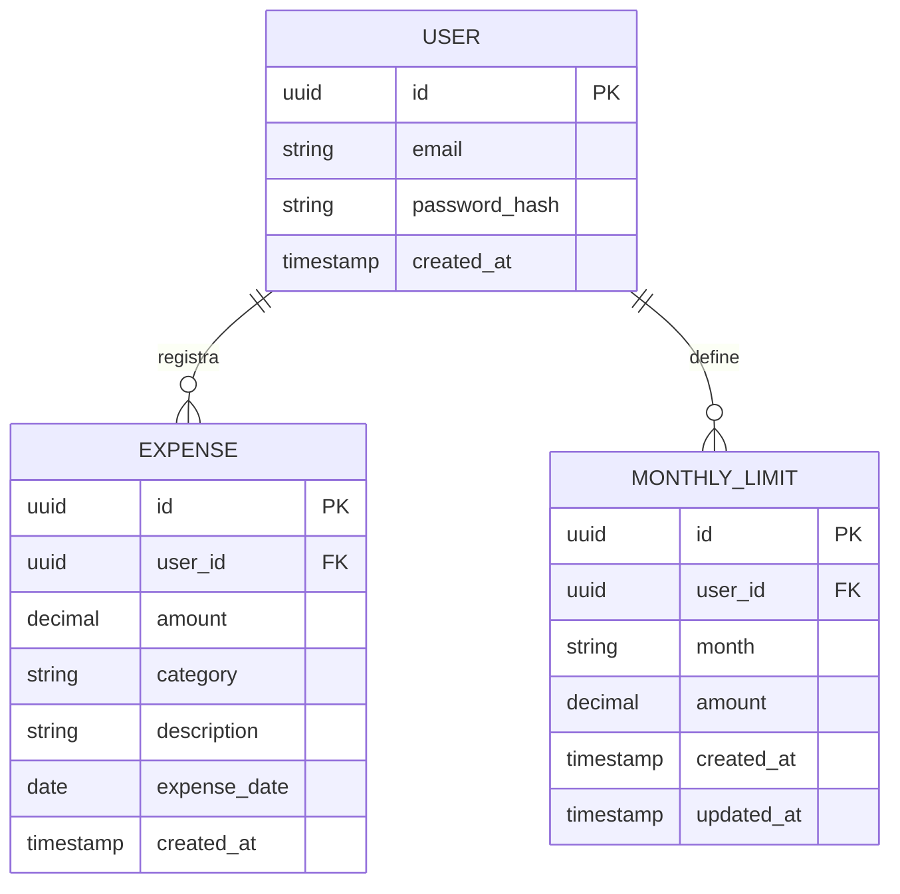

## Índice

0. [Ficha del proyecto](#0-ficha-del-proyecto)
1. [Descripción general del producto](#1-descripción-general-del-producto)
2. [Arquitectura del sistema](#2-arquitectura-del-sistema)
3. [Modelo de datos](#3-modelo-de-datos)
4. [Especificación de la API](#4-especificación-de-la-api)
5. [Historias de usuario](#5-historias-de-usuario)
6. [Tickets de trabajo](#6-tickets-de-trabajo)
7. [Pull requests](#7-pull-requests)

---

## 0. Ficha del proyecto

El objetivo del presente proyecto es por medio del uso de herramientas de Inteligencia Artificial Generativa implementar un proceso de ingeniería de software con el uso de las mismas.

### **0.1. Tu nombre completo:**

Nilson Giovanny Valdés Muñoz

### **0.2. Nombre del proyecto:**

Gestor de Gastos Personal (GGP)

### **0.3. Descripción breve del proyecto:**

Las personas no registran sus gastos porque el proceso suele resultar tedioso, rígido y requiere disciplina constante. El proyecto pretende desarrollar una aplicación web que permita reducir la fricción y mejorar la comprensión financiera con mínima interacción del usuario.
Para ello se pretende que el usuario no solo use la interfaz gráfica de la aplicación sino que pueda usar herramientas como un chatbot para agilizar el registro de los gastos.

### **0.4. URL del proyecto:**

https://github.com/nigivamu/AI4Devs-finalproject

### 0.5. URL o archivo comprimido del repositorio

https://github.com/nigivamu/AI4Devs-finalproject


---

## 1. Descripción general del producto

### **1.1. Objetivo:**

Demostrar cómo un desarrollador puede utilizar IA generativa como copiloto integral a lo largo del ciclo de vida del software. Desde la ideación hasta la validación, mediante la construcción de un MVP funcional de seguimiento de gastos personales con interacción en lenguaje natural.

Para ello se ha escogido desarrollar un Software para Gestión de Gastos Personales que permita:

* **Reducir el esfuerzo y la disciplina** requerida para registrar gastos de forma consistente.
* Brindar control **básico** y percepción temprana de exceso de gasto.
* Mantener simplicidad técnica y foco en el valor principal.
* Permitir decisiones rápidas sin interpretación técnica de datos.

### **1.2. Características y funcionalidades principales:**

El producto:
* Introduce un mecanismo explícito de auto–limitación (tope mensual) que permita al usuario tomar conciencia de sus hábitos de gasto sin análisis financiero avanzado. 
* Comunica eventos relevantes (exceso de tope) en lenguaje natural, evitando métricas abstractas o dashboards complejos. 
* Permite al usuario interactuar con el sistema usando lenguaje natural para registrar información financiera, eliminando formularios complejos y reduciendo fricción cognitiva.
* Gestiona datos únicamente del usuario autenticado, sin funcionalidades sociales ni multiusuario.

### **1.3. Diseño y experiencia de usuario:**

Por avanzar en la fase 3

### **1.4. Instrucciones de instalación:**

**Backend (Python/FastAPI):**
1. Navega a la carpeta `backend/`.
2. Sigue las instrucciones detalladas en [backend/README.md](backend/README.md).
3. Resumen rápido:
   ```bash
   cd backend
   python3 -m venv venv && source venv/bin/activate
   pip install -r requirements.txt
   uvicorn main:app --reload
   ```

---

## 2. Arquitectura del Sistema

### **2.1. Diagrama de arquitectura:**

### **2.2. Descripción de componentes principales:**

### **2.3. Descripción de alto nivel del proyecto y estructura de ficheros**

### **2.4. Infraestructura y despliegue**

Por avanzar en la fase 2

### **2.5. Seguridad**

Por avanzar en la fase 2

### **2.6. Tests**

Por avanzar en la fase 2

---

## 3. Modelo de Datos

### **3.1. Diagrama del modelo de datos:**


### **3.2. Descripción de entidades principales:**

[Definiciones del modelo](02modelodatos.md#seccion-2)

---

## 4. Especificación de la API

Por avanzar en la fase 2
---

## 5. Historias de Usuario

### Flujo E2E seleccionado
** Registro → Login → Definir tope mensual → Registrar gasto → Alerta por excedente **
- Tiene inicio claro (usuario nuevo)
- Tiene decisión explícita (tope)
- Tiene acción repetible (registro de gasto)
- Tiene resultado observable (alerta)
- Permite uso de IA fuera y dentro del código
- Se puede probar extremo a extremo en minutos

**Historia de Usuario 1**
Como usuario nuevo, quiero crear una cuenta con mis credenciales básicas, para poder acceder de forma segura a mi información de gastos personales.

**Historia de Usuario 2**
Como usuario autenticado, quiero definir un tope mensual de gasto, para tener una referencia clara de cuánto puedo gastar durante el mes.

**Historia de Usuario 3**
Como usuario autenticado, quiero registrar un gasto escribiéndolo en lenguaje natural, para evitar formularios complejos y reducir el esfuerzo al llevar el control de mis gastos.

**Historia de Usuario 4**
Como usuario que controla sus gastos, quiero recibir una alerta clara cuando supere mi tope mensual, para ser consciente inmediatamente de que he excedido mi límite.

---

## 6. Tickets de Trabajo

**Ticket 1**

**Ticket 2**

**Ticket 3**

---

## 7. Pull Requests

> Documenta 3 de las Pull Requests realizadas durante la ejecución del proyecto

**Pull Request 1**

**Pull Request 2**

**Pull Request 3**

